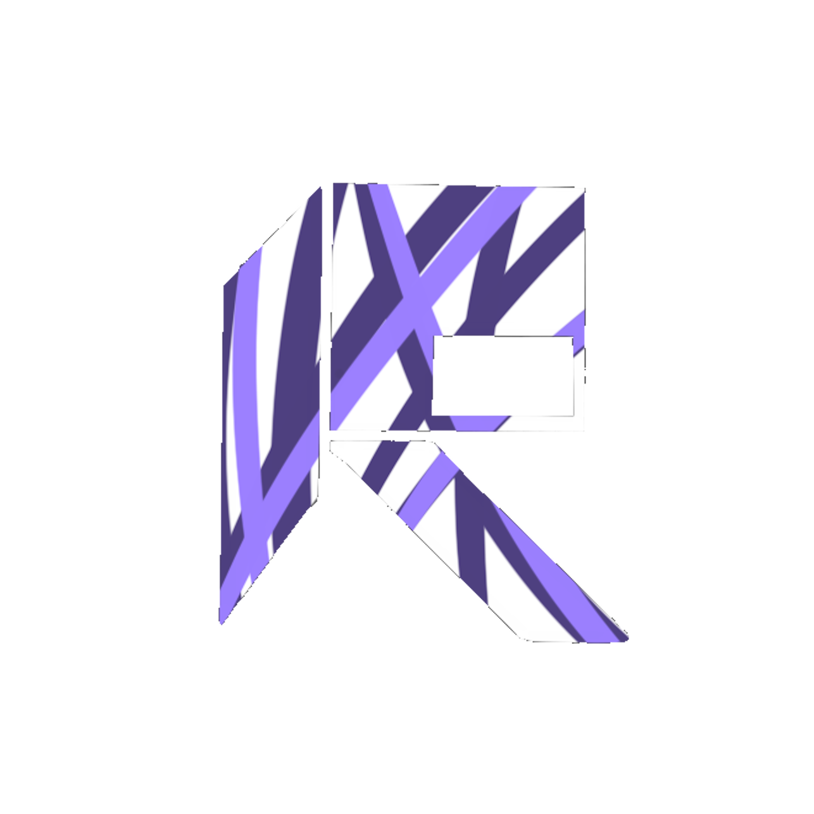
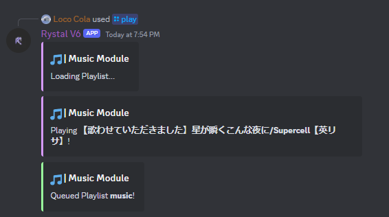
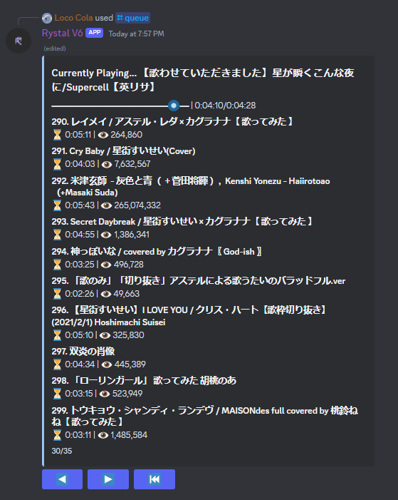
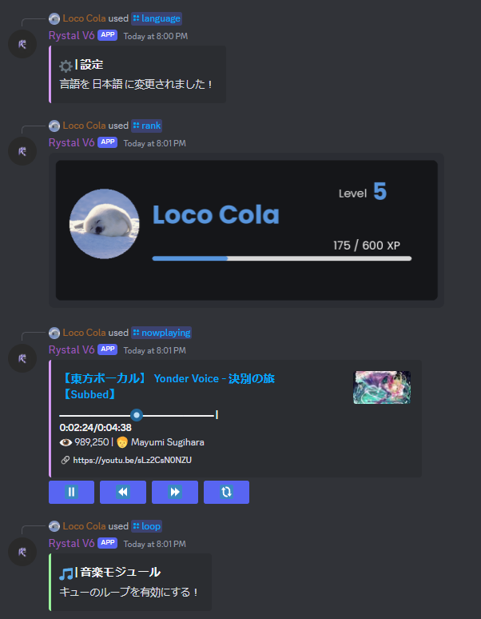
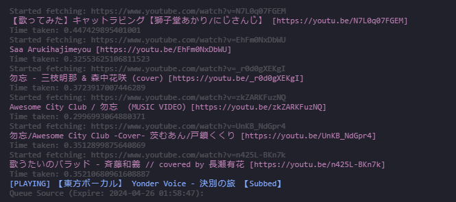

  
  <h3 align="center">Rystal V6</h3>
  

    A simple bot written in python with some decent utilities
     
       
    <a href="https://github.com/Rystal-Team/Rystal-V6/issues">Submit Issues</a>
    · 
    <a href="https://github.com/Rystal-Team/Rystal-V6/releases">Releases</a>
    · 
    <a href="./README-ja.md">日本語</a>
  

## Key Features

- Music Player
    - Player works without any remote server setup such as lavalink/wavelink
    - Provides rich features compared to most discord bots out there written in Python
    - Recap poster for the most played songs previously
- Rank System
- Multi-Language Support
- Point System
- Notes System
- Permissions System
- Mini-games
    - Blackjack
    - Dice
    - Coinflip
    - Jackpot
    - Roulette

## Screenshots

<h2>Show</h2>

## Setup

Download the latest [release](https://github.com/Rystal-Team/Rystal-V6/releases/latest)
from [Releases](https://github.com/Rystal-Team/Rystal-V6/releases).

To run the bot you simply have to install requirements in `requirements.txt`
with `pip install -r <path-to>/requirements.txt`. 
**With containers such as pterodactyl, there might be issue with installing `setuptools` as it's already included. If
this is the case please use `container-requirements.txt` or remove `setuptools` from `requirement.txt` instead.*

The main config file is `.env`, make a copy of `.env.example` and rename it into `.env` and enter the required
tokens. 
Customisations for the bot can be found in `config/example.config.yaml`, make a copy of it and rename it
to `config.yaml` to continue.

## Built With

This Bot is built with and powered by the followings

- 
- 
- 

## Cannot find a hosting provider?

Check out Sparked Host! As cheap as $1 per month! 

- Easy to setup
- Free SQL Database

	
<small>Emoji Icons by <a href="https://icons8.com">icons8</a></small>

	
<small>Copyright © 2024 <a href="https://rystal.net">Rystal</a>. All rights reserved.</small>

